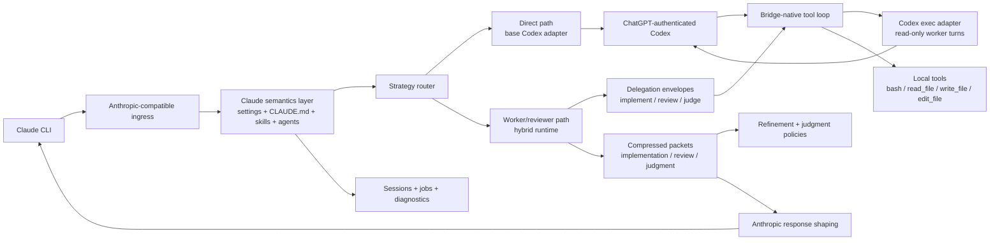

# Architecture

## Goal

Build a local Claude compatibility runtime that preserves useful Claude Code behavior while routing execution into ChatGPT-authenticated Codex.

The runtime is no longer just a proxy. It now acts as a hybrid orchestration layer:

- a direct path for ambiguous or judgment-heavy requests
- a delegated worker path for implementation-heavy tasks
- a reviewer path for findings-first review work
- a packet-compression layer so later stages consume compact artifacts instead of raw transcripts

## Current runtime shape

## High-level layers

### 1. Anthropic-compatible ingress

Implemented in `src/server.ts`.

Responsibilities:

- accept `POST /v1/messages`
- accept `POST /v1/messages/count_tokens`
- accept `POST /v1/messages/background`
- preserve Claude CLI compatibility for simple text and delegated flows

### 2. Claude semantics layer

Implemented in:

- `src/config/compatibility-loader.ts`
- `src/services/message-mapper.ts`
- `src/skills/loader.ts`
- `src/agents/loader.ts`
- `src/permissions/policy.ts`

Responsibilities:

- load Claude settings and instruction files
- load plugins, skills, agents, and MCP definitions
- derive permission intent
- map Anthropic requests into an internal task model

### 3. Strategy router

Implemented in `src/router/strategy-router.ts`.

Responsibilities:

- classify tasks into:
  - `claude_direct`
  - `codex_delegate`
  - `codex_then_claude_refine`
  - `codex_review`
  - `codex_adversarial_review`
  - `codex_review_then_claude_judgment`
- use practical heuristics over the latest user message
- keep obviously review-oriented and implementation-oriented work off the same path

Current note:

- `claude_direct` means "do not delegate to the worker/reviewer runtime".
- It is not a literal Anthropic Claude execution stage.

### 4. Delegation envelope layer

Implemented in `src/delegation/envelopes.ts`.

Responsibilities:

- compress a task into a clean worker/reviewer packet
- avoid forwarding the full raw conversation when unnecessary
- shape prompts differently for:
  - implementation
  - review
  - adversarial review
  - refinement
  - judgment

Envelope contents include:

- concise task statement
- likely file scope
- acceptance criteria
- allowed tool assumptions
- required output packet format

### 5. Worker/reviewer orchestration

Implemented in `src/orchestrator/hybrid-runtime.ts`.

Responsibilities:

- run the direct path unchanged for `claude_direct`
- run implementation delegation and packet capture for `codex_delegate`
- run first-pass implementation plus refinement policy for `codex_then_claude_refine`
- run review and adversarial review packet capture for review modes
- run judgment policy plus a constrained second pass for `codex_review_then_claude_judgment`

This file is the central manager/worker/reviewer runtime.

### 6. Bridge-native tool loop

Implemented in `src/tools/loop.ts`.

Responsibilities:

- provide Codex with explicit bridge-native tool definitions
- require a strict machine-readable response envelope
- parse tool calls deterministically
- execute local tools through the bridge
- append structured tool results back into the next Codex turn
- repeat until Codex emits a final answer or a packet

Currently supported tools:

- `bash`
- `read_file`
- `write_file`
- `edit_file`

### 7. Compressed packet layer

Implemented in:

- `src/orchestrator/types.ts`
- `src/orchestrator/packets.ts`

Responsibilities:

- parse `bridge-packet` JSON blocks
- normalize implementation and review packets
- render compact human-facing summaries
- derive a judgment packet from a review packet

Packet kinds emitted into session events:

- `implementation`
- `review`
- `judgment`

### 8. Refinement and judgment policies

Implemented in:

- `src/refinement/policy.ts`
- `src/review/judgment-policy.ts`

Responsibilities:

- decide whether a first-pass implementation packet should be accepted or refined
- derive a prioritized judgment packet from review findings
- support a smaller second pass without replaying the full worker transcript

Important honesty note:

- these are bridge policies, not real runtime Claude reasoning stages
- the refinement and judgment workflows are useful approximations built on compact packets plus optional constrained Codex follow-up

### 9. Persistence and diagnostics

Implemented in:

- `src/session/persistent-session-store.ts`
- `src/background/job-manager.ts`
- `src/diagnostics/service.ts`
- `src/mcp/service.ts`

Responsibilities:

- persist session transcripts and events
- persist background jobs and task graphs
- record `strategy-selected`, `tool-call`, `tool-result`, and `packet` events
- expose config, compatibility, MCP, session, and job diagnostics

## Execution mode behavior

### `claude_direct`

- route stays on the direct adapter path
- no worker packet is created
- best for ambiguity and judgment-heavy asks

### `codex_delegate`

- worker gets an implementation envelope
- worker may use bridge-native tools with write access semantics
- runtime returns a compressed implementation packet summary

### `codex_then_claude_refine`

- worker gets an implementation envelope
- runtime parses the implementation packet
- refinement policy decides whether to accept it or run a second constrained pass
- final output is based on the packet or the refinement pass, not the full worker transcript

### `codex_review`

- reviewer gets a review envelope
- reviewer runs read-only inspection through the bridge-native tool loop
- final output is findings-first

### `codex_adversarial_review`

- same structure as `codex_review`
- prompt is more skeptical and failure-mode oriented
- intended to surface hidden risks, security issues, and brittle assumptions

### `codex_review_then_claude_judgment`

- reviewer produces a compressed review packet
- bridge derives a judgment packet heuristically
- runtime may run a second constrained "judge" pass over the compressed packet
- final output is concise and prioritized

## Why worker turns still run read-only on the Codex side

For bridge-tool turns, the runtime constrains the Codex-side execution context to read-only.

Why:

- `codex exec` is agentic enough to sometimes do file work itself
- the bridge needs side effects to go through the bridge-native tools
- this keeps write/edit/command execution under bridge control even when the worker is allowed to request those actions

So the runtime:

- tells Codex not to use native tools directly
- sets the Codex-side sandbox to `read-only` for the loop turn
- lets the bridge-native tool executor remain the real execution authority

## Adapter strategy

### `codex exec`

This is the primary execution path for:

- worker delegation
- review flows
- refinement/judgment follow-up
- bridge-native tool loops

Why:

- locally verified with ChatGPT login
- reliable enough for repeated worker turns
- easy to wrap with the bridge-native tool loop

### `codex app-server`

Still useful for:

- account probing
- MCP-oriented host integration work
- future structured runtime experiments

But direct turn execution remains unstable in this repo, so it is not the primary engine for hybrid orchestration.

## Response behavior toward Claude

Today the Anthropic-facing response model is staged:

- final answer is preserved cleanly
- route selection and packet creation are logged in session events
- tool activity is recorded in session events and logs
- compressed packet summaries avoid replaying full worker transcripts

What is not done yet:

- Anthropic-style outbound `tool_use` parity
- first-class streaming of intermediate tool events
- a true Anthropic Claude refinement or judgment stage inside the bridge

## Honest architectural summary

The runtime has crossed another important threshold:

- before: local proxy with compatibility context and bridge-native tools
- now: local manager/worker/reviewer runtime with routing, delegation, compression, and review judgment

It is still not a transparent Claude backend replacement, but it is substantially closer to the intended "Claude manager + Codex worker/reviewer" operating model.
